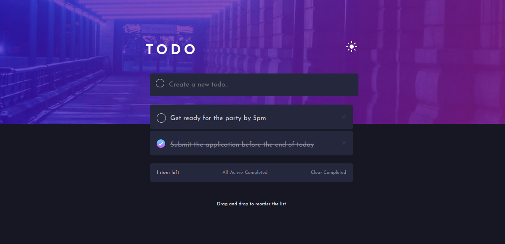

# Todo App

This is a solution to the [Todo app challenge on Frontend Mentor](https://www.frontendmentor.io/challenges/todo-app-Su1_KokOW). Frontend Mentor challenges help you improve your coding skills by building realistic projects.

## Table of contents

- [Overview](#overview)
  - [The challenge](#the-challenge)
  - [Screenshot](#screenshot)
  - [Links](#links)
- [My process](#my-process)
  - [Built with](#built-with)
  - [What I learned](#what-i-learned)
- [Author](#author)

**Note: Delete this note and update the table of contents based on what sections you keep.**

## Overview

### The challenge

Users should be able to:

- View the optimal layout for the app depending on their device's screen size
- See hover states for all interactive elements on the page
- Add new todos to the list
- Mark todos as complete
- Delete todos from the list
- Filter by all/active/complete todos
- Clear all completed todos
- Toggle light and dark mode
- **Bonus**: Drag and drop to reorder items on the list

### Screenshot

### Links

- Solution URL: [Github link](https://todolist-appxi.vercel.app/)
- Live Site URL: [LIVE SITE](https://todolist-appxi.vercel.app/)

## My process

### Built with

- Semantic HTML5 markup
- Flexbox
- Mobile-first workflow
- [React](https://reactjs.org/) - JS library
- [SCSS](https://sass-lang.com/) - For styles

### What I learned

- State Management: Which I used to add, remove and update tasks
- Breaking Down UI into reusable component
- Using SCSS allows for more organized and scalable styles compared to plain CSS
- Conditional rendering is often used to show different UI states

## Author

- Website - [Nnenna Udefi](https://nnennaudefi.vercel.app/)
- Frontend Mentor - [@Nnenna-udefi](https://www.frontendmentor.io/profile/Nnenna-udefi)
- Twitter - [@nnennaudefi](https://www.twitter.com/nnennaudefi)

## Getting Started with Create React App

This project was bootstrapped with [Create React App](https://github.com/facebook/create-react-app).

To start the project after cloning, you can run:

### `npm install` to install the dependencies

and then

### `npm start`

Runs the app in the development mode.\
Open [http://localhost:3000](http://localhost:3000) to view it in your browser.

The page will reload when you make changes.\
You may also see any lint errors in the console.
